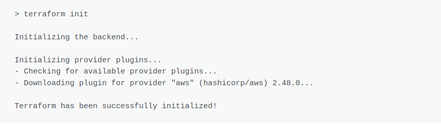
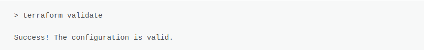
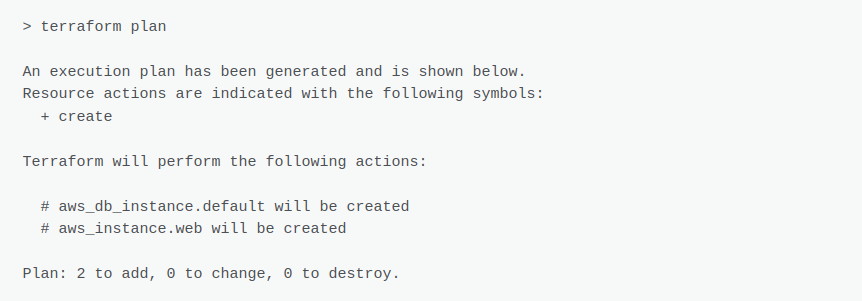
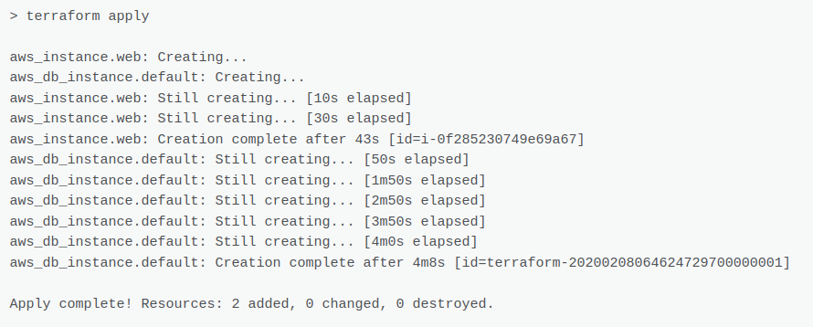
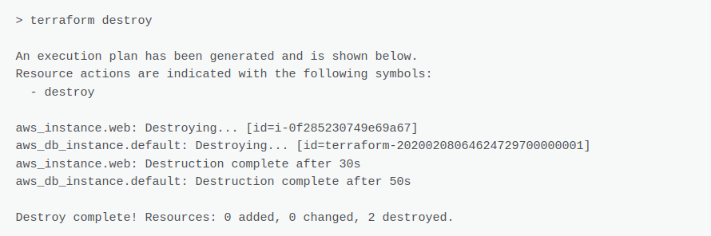

# Terraform Cloud

The Terraform script defines an **aws_instance** resource named **myec2** of type **t2.micro**, it provisions an EC2 instance in your AWS account.

## Technologies

**Terraform :** Provider AWS

**Cloud AWS :** EC2


## Features


- defines a resource called "ec2 instance".
- defined the AMI to use for the EC2 instance.
## prerequisites

- **AWS Account:** You must have an AWS account with the necessary permissions to create EC2 resources.
- **Terraform installed:** Install Terraform on your local machine by following the instructions at https://developer.hashicorp.com/terraform/tutorials/aws-get-started/install-cli.
- **Text editor:** You will need a text editor to create and edit your Terraform configuration files.
## Installation


\
In your command prompt download the repo with the commands:
```bash
  git clone https://github.com/AnselmeG300/terraform-cloud.git
  cd terraform-cloud
  code . 
```

    
## Deployment

\
1- Let's start by typing the Terraform **initialization** command. You must do this in the current folder where you created the previous files.
```bash
 terraform init
```

\
2- We validate that everything is fine in our configuration.
```bash
 terraform validate
```

\
3- Then, we **plan** our next action. We should only have creations since we are on an infra-virgin.
```bash
 terraform plan
```

\
4- And now, the fateful moment that makes all the magic of this type of tool. We will **implement** our plan. This will have the effect of actually creating our infrastructure on the cloud.
```bash
 terraform apply
```

\
5- If you want to destroy the provisioned EC2 instance, run the following command:
```bash
 terraform destroyed
```


## Authors

- [@AnselmeG300](https://github.com/AnselmeG300/terraform-cloud.git)


## License

[MIT](https://choosealicense.com/licenses/mit/)


## Badges

Add badges from somewhere like: [shields.io](https://shields.io/)

[](https://choosealicense.com/licenses/mit/)
[](https://opensource.org/licenses/)
[](http://www.gnu.org/licenses/agpl-3.0)

